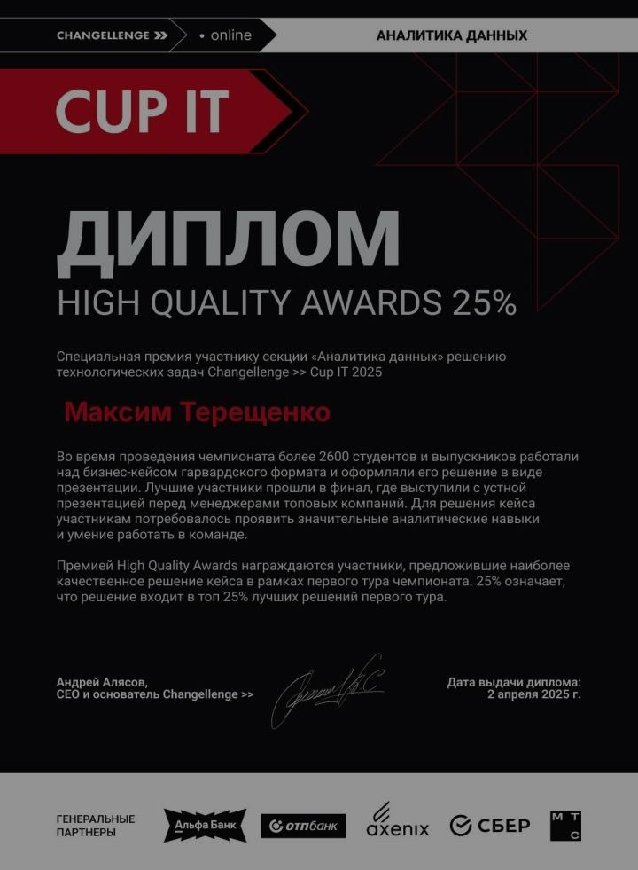

# 🚀 Welcome to My GitHub Profile!

---

## 🎓 Education

Maxim Andreevich

📅 1st-year student  

🎓 **SPbSUT - Saint Petersburg State University of Telecommunications named after Bonch-Bruevich**  

🏛  Faculty of **Information Technology** and **Software Engineering**  

📍 Saint Petersburg, Russia

---

## 🔥 My Tech Stack

### 🚀 Programming Languages


### 🛠️ Technologies & Tools


### 🎨 Additional skills


---

## 🏆 Achievements

[](./certificates/changellenge_cupit_2025.png)  
📍 **Changellenge >> Cup IT 2025**, Data Analytics Section | 🗓️ April 2, 2025  
_Received a **High Quality Awards 25%** diploma for providing one of the top 25% solutions in the first round of the case championship._  
📄 [View Certificate](./certificates/changellenge_cupit_2025.png)



## 📌 My Projects
🔹 **[University Labs](#)** - A collection of university labs in **Programming, Computer Science, and Algorithmic Foundations of Software Engineering**.  
🔹 **[CMPMARKET](#)** - A website that provides an aggregated summary of product data from multiple marketplaces.  

---

## 📊 GitHub Stats


---

## 💬 Let's Connect!
[](https://discord.com/users/455333624318001163)
[](https://t.me/VoltusVOFF)
[](https://github.com/VoltusV5)
###  Discord username:
```
voltusv_gg
```
###  Telegram username:
```
@VoltusVOFF
```
---
🌟 **Feel free to check out my repositories and contribute!**  
🚀 **Let's build something amazing together!**
